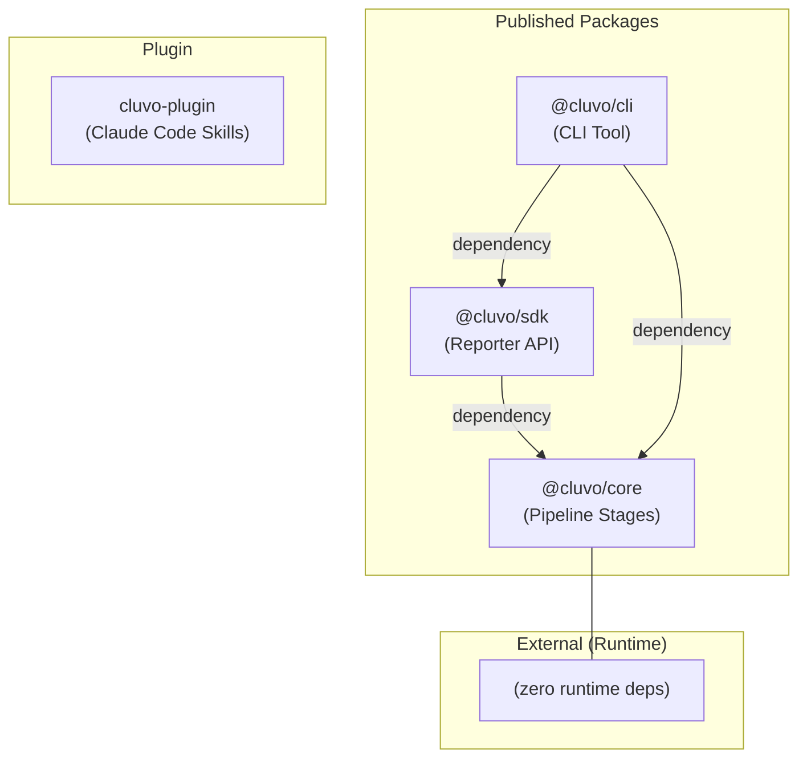
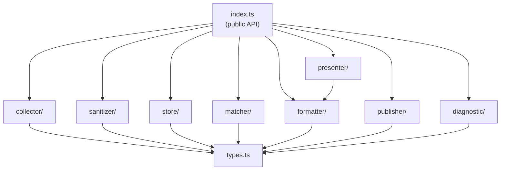
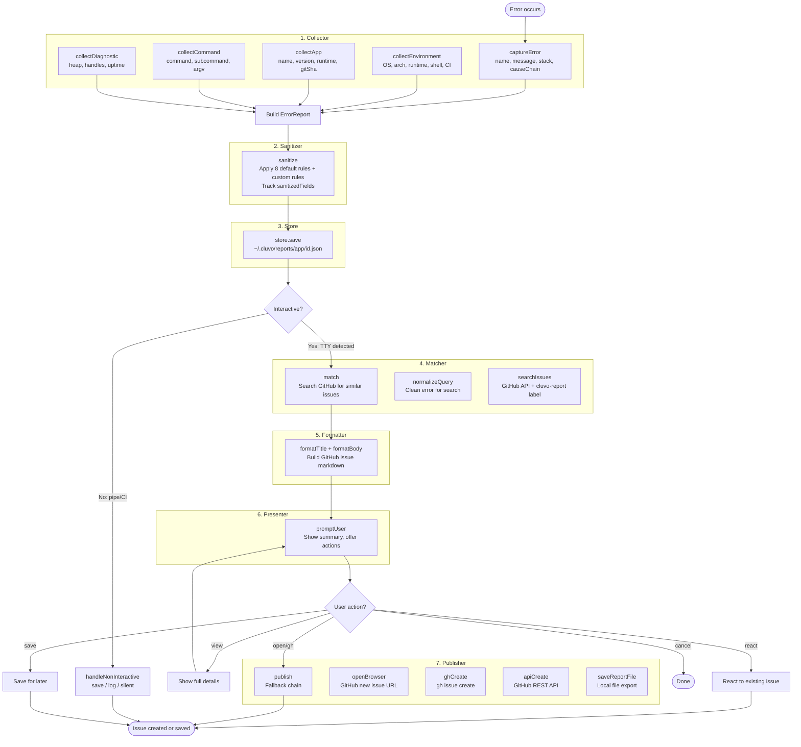
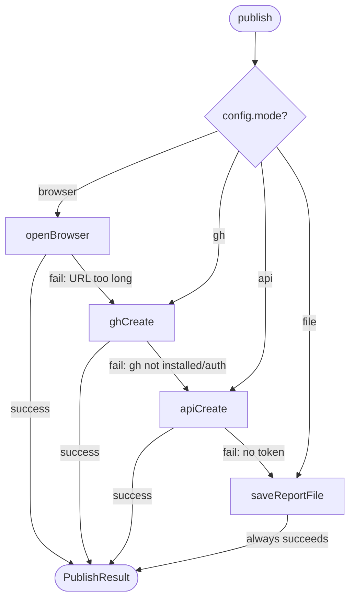
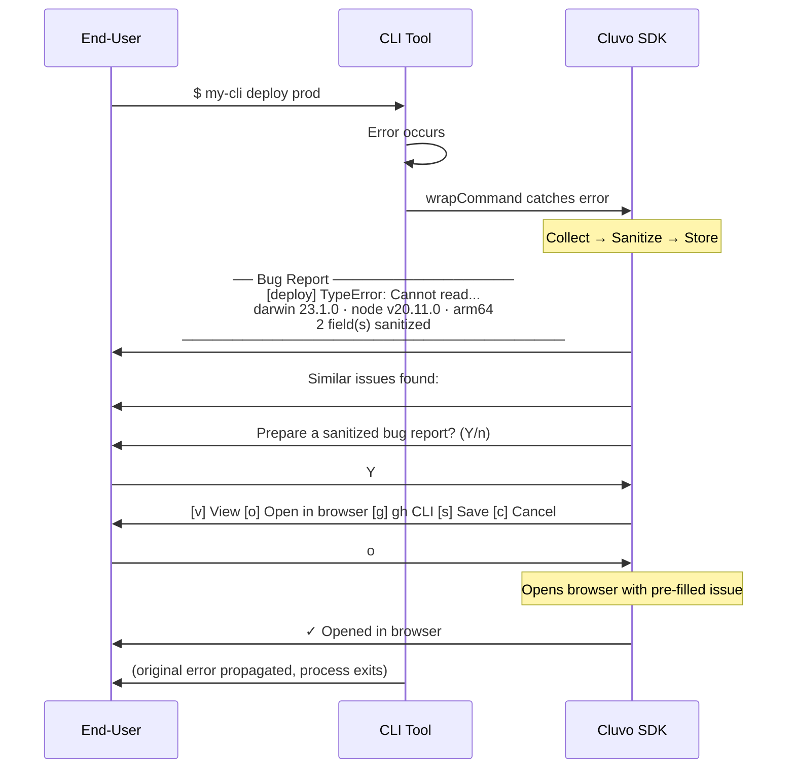
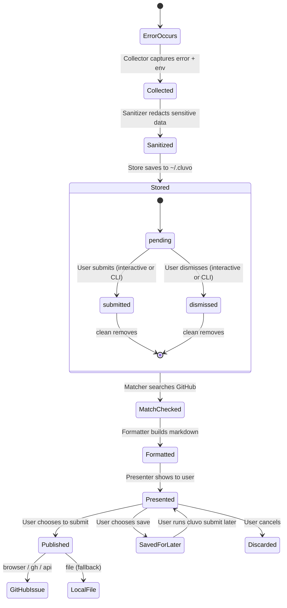

# Cluvo Architecture Documentation

> **Cluvo** — A local-first bug reporting SDK for open-source CLIs/SDKs. Captures errors, sanitizes sensitive data, lets users review before submitting, and publishes GitHub issues.

This document provides a comprehensive architectural overview of Cluvo, including monorepo structure, package dependencies, the core pipeline, design patterns, and data flows.

---

## Table of Contents

1. [System Overview](#system-overview)
2. [Monorepo Structure](#monorepo-structure)
3. [Package Dependency Graph](#package-dependency-graph)
4. [Core Package Architecture](#core-package-architecture)
5. [Error Reporting Pipeline](#error-reporting-pipeline)
6. [Sanitizer System](#sanitizer-system)
7. [Store System](#store-system)
8. [Matcher System](#matcher-system)
9. [Presenter System](#presenter-system)
10. [Publisher System](#publisher-system)
11. [SDK Package Architecture](#sdk-package-architecture)
12. [CLI Package Architecture](#cli-package-architecture)
13. [Integration Patterns](#integration-patterns)
14. [End-User Experience](#end-user-experience)
15. [Report Lifecycle](#report-lifecycle)
16. [Plugin System](#plugin-system)
17. [Build System](#build-system)

---

## System Overview

### High-Level Architecture

```
┌────────────────────────────────────────────────────────────────────────┐
│               Cluvo — Local-First Bug Reporting SDK                    │
└────────────────────────────────────────────────────────────────────────┘

User Code            SDK Layer           Core Modules        External
─────────            ─────────           ────────────        ────────

try {               createReporter()  →  Collector       →  GitHub API
  app.run()            (sdk)             Sanitizer           GitHub Issues
} catch (err) {        • Config          Store               gh CLI
  reporter             • Orchestrate     Matcher             Browser
    .reportError(err)  • Lifecycle       Formatter           File system
}                            ↓           Presenter
                       @cluvo/core       Publisher
                       (pipeline)           │
                                            ↓
                            Fallback chain:
                            browser → gh CLI → API → file
```

### Key Components

| Component | Package | Responsibility |
|-----------|---------|----------------|
| **Core** | `packages/core` | Zero-dependency pipeline stages (collector, sanitizer, store, matcher, formatter, presenter, publisher, diagnostic) |
| **SDK** | `packages/sdk` | High-level `createReporter()` API, config resolution, lifecycle orchestration |
| **CLI** | `packages/cli` | `cluvo` command for managing stored reports (list, show, submit, dismiss, clean) |
| **Plugin** | `plugins/cluvo-plugin` | Claude Code skills for guided SDK onboarding |

### Design Principles

1. **Local-First**: Reports are stored locally before submission, allowing user review and control
2. **Zero Core Dependencies**: `@cluvo/core` has no external runtime dependencies — embeddable anywhere
3. **Pre-Submission Sanitization**: Sensitive data (tokens, keys, paths, emails) is redacted before the user sees anything
4. **Fallback Chain**: Publisher always succeeds by gracefully degrading: browser → gh CLI → GitHub API → local file
5. **Interactive Auto-Detection**: TTY mode with raw-mode prompts; automatic fallback to non-interactive for CI/pipes

---

## Monorepo Structure

```
cluvo/
├── packages/
│   ├── core/                              @cluvo/core (Pipeline Stages)
│   │   ├── src/
│   │   │   ├── index.ts                   Public API exports
│   │   │   ├── types.ts                   Core type definitions
│   │   │   ├── collector/                 Error & environment capture
│   │   │   ├── sanitizer/                 Sensitive data redaction
│   │   │   ├── store/                     Filesystem persistence
│   │   │   ├── matcher/                   GitHub issue deduplication
│   │   │   ├── formatter/                 Markdown issue generation
│   │   │   ├── presenter/                 Interactive TTY prompts
│   │   │   ├── publisher/                 Multi-strategy issue submission
│   │   │   └── diagnostic/                Memory/heap diagnostics
│   │   └── test/                          16 test files
│   │
│   ├── sdk/                               @cluvo/sdk (Orchestration)
│   │   ├── src/
│   │   │   ├── index.ts                   Reporter interface exports
│   │   │   ├── reporter.ts                createReporter() implementation
│   │   │   └── config.ts                  resolveConfig() with defaults
│   │   └── test/                          3 test files
│   │
│   └── cli/                               @cluvo/cli (CLI Tool)
│       └── src/
│           ├── bin.ts                     CLI entry point & routing
│           ├── index.ts                   Command exports
│           └── commands/
│               ├── list.ts                List reports by app/status
│               ├── show.ts                Show report details
│               ├── submit.ts              Submit to GitHub
│               ├── dismiss.ts             Mark as dismissed
│               └── clean.ts              Remove old reports
│
├── plugins/
│   └── cluvo-plugin/                      Claude Code plugin (skills)
│
├── .github/workflows/
│   ├── ci.yml                             Lint, typecheck, test
│   ├── changeset-check.yml                Verify changeset in PRs
│   └── release.yml                        Build & publish to npm
│
├── biome.json                             Linter/formatter config
├── pubm.config.ts                         Release management config
└── tsconfig.json                          Composite project references
```

### Workspace Configuration

- **Manager**: Bun workspaces (root `package.json`)
- **TypeScript**: Composite project references (`tsc --build`)
- **Linting/Formatting**: Biome v2 (tabs, single quotes, no semicolons)
- **Release**: pubm (fixed versioning, changeset-based)

---

## Package Dependency Graph



### Dependency Direction

| From | To | Type | Reason |
|------|-----|------|--------|
| `@cluvo/sdk` → `@cluvo/core` | dependency | SDK orchestrates core pipeline stages |
| `@cluvo/cli` → `@cluvo/core` | dependency | CLI uses Store, Formatter directly |
| `@cluvo/cli` → `@cluvo/sdk` | dependency | CLI uses createReporter for submit |

### Linear Dependency Chain

```
@cluvo/core  →  @cluvo/sdk  →  @cluvo/cli
(stages)        (orchestration)  (user-facing)
```

---

## Core Package Architecture

### Module Organization

```
packages/core/src/
│
├── index.ts                 Public API exports
├── types.ts                 Core type definitions (ErrorReport, ReporterConfig, etc.)
│
├── collector/               Error & Environment Capture
│   ├── index.ts
│   ├── capture-error.ts     Error → ErrorPayload (name, message, stack, causeChain)
│   ├── collect-app.ts       Config → AppContext (name, version, runtime, gitSha)
│   ├── collect-command.ts   argv → CommandContext (command, subcommand, argv)
│   ├── collect-environment.ts  → EnvironmentPayload (OS, arch, runtime, shell, CI)
│   └── global-handlers.ts   uncaughtException & unhandledRejection handlers
│
├── sanitizer/               Sensitive Data Redaction
│   ├── index.ts
│   ├── sanitize.ts          Apply rules to all string fields in ErrorReport
│   └── rules.ts             DEFAULT_RULES (8 patterns) + sensitive flag list
│
├── store/                   Filesystem Persistence
│   ├── index.ts
│   └── store.ts             Store class (~/.cluvo/reports/<app>/<id>.json)
│
├── matcher/                 GitHub Issue Deduplication
│   ├── index.ts
│   ├── match.ts             match() → MatchResult with existing issues
│   ├── search-issues.ts     GitHub search API (issues + discussions)
│   └── normalize-query.ts   Clean error name/message for search
│
├── formatter/               GitHub Issue Markdown Generation
│   ├── index.ts
│   ├── format.ts            formatTitle() + formatBody()
│   └── sections.ts          SECTION_RENDERERS: summary, environment, command, stackTrace, etc.
│
├── presenter/               Interactive User Prompts
│   ├── index.ts
│   ├── interactive.ts       Raw-mode TTY input (single-key commands)
│   ├── noninteractive.ts    Non-TTY fallback (save/log/silent)
│   └── render.ts            renderSummary(), renderDetails(), renderPromptMessage()
│
├── publisher/               Multi-Strategy Issue Submission
│   ├── index.ts
│   ├── publish.ts           Fallback chain orchestrator
│   ├── browser.ts           Platform-specific URL opener
│   ├── gh-cli.ts            gh issue create wrapper
│   ├── github-api.ts        Direct GitHub API POST
│   ├── file-export.ts       Local markdown/JSON export
│   ├── auth.ts              GitHub auth detection (gh CLI, env tokens)
│   └── terminal.ts          Terminal draft rendering
│
└── diagnostic/              Optional Runtime Diagnostics
    ├── index.ts
    └── diagnostic.ts        Heap, handles, uptime collection
```

### Module Dependency Flow



Each module is independently importable and testable — no cross-module dependencies except shared types.

---

## Error Reporting Pipeline

### Pipeline Entry Point

`createReporter(config)` in `sdk/src/reporter.ts` orchestrates the full pipeline. The `reportError()` method drives collection, and `promptAndSubmit()` drives user interaction and submission.

### Complete Pipeline Flow



### Pipeline Stages Summary

```
┌──────────────┬─────────────────────────────────────────────────────────────────┐
│ Stage        │ Purpose                                                         │
├──────────────┼─────────────────────────────────────────────────────────────────┤
│ Collector    │ Capture error payload + environment + app info + command args    │
│ Sanitizer    │ Redact tokens, keys, emails, paths before user sees anything    │
│ Store        │ Persist to ~/.cluvo/reports/<app>/<id>.json with status tracking│
│ Matcher      │ Search GitHub for duplicate issues (cluvo-report label priority)│
│ Formatter    │ Build GitHub issue title + sectioned markdown body              │
│ Presenter    │ Interactive TTY prompts with single-key actions                 │
│ Publisher    │ Submit via fallback chain: browser → gh → API → file            │
│ Diagnostic   │ Optional heap/memory/handle snapshot                            │
└──────────────┴─────────────────────────────────────────────────────────────────┘
```

---

## Sanitizer System

The sanitizer runs before the user sees any data and before any external submission. It applies regex-based rules to all string fields in the error report.

### Default Rules

```
┌──────────────────┬────────────────────────────────────────────────┬─────────────────────────┐
│ Rule             │ Pattern                                        │ Replacement             │
├──────────────────┼────────────────────────────────────────────────┼─────────────────────────┤
│ bearer-token     │ Bearer\s+[A-Za-z0-9\-._~+/]+=*               │ Bearer [REDACTED]       │
│ github-token     │ gh[ps]_[A-Za-z0-9_]{36,}                     │ [REDACTED]              │
│ generic-api-key  │ api_?key|apikey|secret_?key|access_?token...  │ [REDACTED]              │
│ password         │ password|passwd|pwd...                         │ [REDACTED]              │
│ sk-token         │ sk[_-](?:live|test)[_-][A-Za-z0-9]{10,}      │ [REDACTED]              │
│ email            │ [A-Za-z0-9._%+-]+@([domain])                  │ ***@domain              │
│ private-key      │ -----BEGIN.*PRIVATE KEY-----...               │ [REDACTED PRIVATE KEY]  │
│ home-path        │ (dynamic from process.env.HOME)               │ ~                       │
└──────────────────┴────────────────────────────────────────────────┴─────────────────────────┘
```

### Sensitive CLI Flags

Command-line arguments following these flags are redacted:

```
--token, --api-key, --secret, --password, --auth, -t, --access-token, --api-token
```

### Sanitization Flow

```
sanitize(report, options?)
  ├─ Build rule set: DEFAULT_RULES + customRules (if provided)
  ├─ Add dynamic home-path rule from process.env.HOME
  ├─ Walk all string fields in report recursively
  │   ├─ Apply each regex rule
  │   └─ Track field path in sanitizedFields[]
  ├─ Redact argv values after sensitive flags
  └─ Return modified ErrorReport with sanitizedFields tracking
```

---

## Store System

Local filesystem persistence for error reports, enabling offline capture and deferred submission.

### Storage Layout

```
~/.cluvo/
└── reports/
    ├── my-cli/
    │   ├── 1711234567890-abc123.json     (pending)
    │   ├── 1711234567891-def456.json     (submitted)
    │   └── 1711234567892-ghi789.json     (dismissed)
    └── other-app/
        └── ...
```

### Store Class API

```
Store(baseDir, maxReports = 100)
├── save(report)           — Write JSON, evict if over maxReports
├── load(app)              — List all reports for an app
├── findById(id)           — Lookup report by ID (searches all apps)
├── list(filter?)          — List with optional status/app filter
├── updateStatus(id, status, metadata?)  — Update status + optional issueUrl
├── delete(id)             — Remove report file
└── clean(options?)        — Remove old submitted/dismissed reports
```

### Eviction Strategy

When `maxReports` is exceeded, reports are evicted by priority:
1. **Submitted** reports (already published) — evict first
2. **Dismissed** reports (user rejected) — evict second
3. **Pending** reports (awaiting action) — evict last

Within each priority tier, oldest reports are evicted first.

---

## Matcher System

Deduplicates error reports by searching GitHub for similar existing issues before submission.

### Match Flow

```
match(report, config)
  ├─ normalizeQuery(error)
  │   ├─ Combine error.name + error.message
  │   ├─ Remove file paths, line numbers
  │   ├─ Remove special characters
  │   └─ Truncate to search-friendly length
  │
  ├─ searchIssues(repo, query, options)
  │   ├─ Search with label:cluvo-report (priority matches)
  │   ├─ Search general issues
  │   ├─ Optionally search discussions
  │   └─ Deduplicate + rank by relevance
  │
  └─ Return MatchResult
      ├─ found: boolean
      └─ matches: ExistingIssue[] (top 5)
          ├─ type: 'issue' | 'discussion'
          ├─ number, title, url
          ├─ state: 'open' | 'closed'
          ├─ labels: string[]
          └─ createdAt: string
```

---

## Presenter System

Handles user interaction with two distinct modes based on TTY detection.

### Interactive Mode (TTY)

```
promptUser(report, draft, config, authAvailable)
  ├─ renderSummary(report)     — One-line error overview
  ├─ renderPromptMessage()     — Available action keys
  │
  └─ Raw-mode single-key input:
     ├─ Y/Enter  → 'open' (submit via preferred method)
     ├─ v        → 'view' (show full report details)
     ├─ r        → 'react' (react to existing issue)
     ├─ g        → 'gh' (submit via gh CLI)
     ├─ s        → 'save' (save for later)
     └─ n/q/Esc  → 'cancel'
```

### Non-Interactive Mode (Pipe/CI)

```
handleNonInteractive(report, mode, filePath?)
  ├─ mode = 'save'   → Store report for later CLI review
  ├─ mode = 'log'    → Print report summary to stderr
  └─ mode = 'silent' → Silently discard
```

### TTY vs Non-TTY Behavior

```
┌──────────────────────┬────────────────────────────┬────────────────────────────┐
│ Behavior             │ TTY (Interactive)          │ Non-TTY (Pipe/CI)          │
├──────────────────────┼────────────────────────────┼────────────────────────────┤
│ Detection            │ process.stdout.isTTY       │ !process.stdout.isTTY      │
│ User prompt          │ Raw-mode single-key input  │ No prompt                  │
│ Report review        │ View details interactively │ Not available              │
│ Default action       │ Open in browser            │ Save to store              │
│ Existing matches     │ Show + offer react         │ Skip                       │
│ Override             │ interactive: 'auto'        │ nonInteractive: mode       │
└──────────────────────┴────────────────────────────┴────────────────────────────┘
```

---

## Publisher System

The publisher implements a fallback chain that always succeeds — worst case, the issue is saved as a local file.

### Fallback Chain



### Publishing Strategies

```
┌─────────────────┬────────────────────────────────────────────────────────────────┐
│ Strategy        │ Details                                                        │
├─────────────────┼────────────────────────────────────────────────────────────────┤
│ browser         │ Build GitHub new-issue URL with pre-filled title/body          │
│                 │ Platform-specific: open (macOS), xdg-open (Linux),             │
│                 │ cmd /c start (Windows). Limit: 8000 chars.                     │
├─────────────────┼────────────────────────────────────────────────────────────────┤
│ gh              │ Shell out to `gh issue create --title --body --label --repo`   │
│                 │ Requires: gh CLI installed + authenticated                     │
├─────────────────┼────────────────────────────────────────────────────────────────┤
│ api             │ Direct POST to GitHub REST API (/repos/:owner/:repo/issues)   │
│                 │ Requires: GITHUB_TOKEN or GH_TOKEN env var                     │
├─────────────────┼────────────────────────────────────────────────────────────────┤
│ file            │ Save as markdown or JSON to local filesystem                   │
│                 │ Always available — final fallback                              │
└─────────────────┴────────────────────────────────────────────────────────────────┘
```

### Auth Detection

```
isAuthAvailable(config)
  ├─ Check GITHUB_TOKEN env var
  ├─ Check GH_TOKEN env var
  ├─ checkGhInstalled() → which gh
  └─ checkGhAuth() → gh auth status

getGithubToken()
  ├─ process.env.GITHUB_TOKEN
  └─ process.env.GH_TOKEN
```

---

## SDK Package Architecture

### Reporter Interface

The SDK exposes a single `createReporter()` factory that returns a `Reporter` object:

```typescript
interface Reporter {
  // High-level API (most users)
  reportError(error, context?): Promise<ErrorReport>
  promptAndSubmit(report): Promise<void>
  installGlobalHandlers(): () => void      // Returns uninstall function
  wrapCommand(fn): Promise<void>           // Try/catch with auto-report

  // Low-level API (advanced users)
  buildReport(error, context?): ErrorReport
  sanitizeReport(report): ErrorReport
  findMatches(report): Promise<MatchResult>
  buildDraft(report): DraftPayload
  publish(draft): Promise<PublishResult>
}
```

### Config Resolution

`resolveConfig()` applies defaults to the user-provided `ReporterConfig`:

```
resolveConfig(config)
  ├─ mode:           config.mode           ?? 'browser'
  ├─ interactive:    config.interactive    ?? 'auto'
  ├─ nonInteractive: config.nonInteractive ?? 'save'
  ├─ storeDir:       config._storeDir      ?? ~/.cluvo
  ├─ collect:
  │   ├─ argv:              true
  │   ├─ diagnosticReport:  false
  │   ├─ configSummary:     false
  │   └─ envinfo:           true
  ├─ store:    { enabled: true,  maxReports: 100 }
  ├─ sanitize: { enabled: true }
  ├─ dedupe:   { enabled: true,  searchDiscussions: false }
  └─ branding: { showName: false }
```

### Config Injection Pattern

```
┌────────────────────────────────────────────────────────────────────────┐
│                    Config Injection Pattern                             │
└────────────────────────────────────────────────────────────────────────┘

User-Facing Config (ReporterConfig)
  │  Provided by SDK consumer
  │  Partial — all fields optional except repo + app
  │
  ▼
resolveConfig()
  │  Apply defaults
  │
  ▼
Resolved Config
  │  Complete — all fields populated
  │  Passed to every pipeline stage
  │
  ▼
InternalConfig (extends ReporterConfig)
   │  Adds _storeDir for test-time dependency injection
   │  Allows overriding filesystem paths in tests
   └─ Used only in test code
```

---

## CLI Package Architecture

### Command Routing

```
$ cluvo <command> [options]

bin.ts
  ├─ parse argv
  └─ route to command handler:
     ├─ list    → commands/list.ts
     ├─ show    → commands/show.ts
     ├─ submit  → commands/submit.ts
     ├─ dismiss → commands/dismiss.ts
     └─ clean   → commands/clean.ts
```

### Commands

```
┌──────────────┬──────────────────────────────────────────────────────────────────┐
│ Command      │ Purpose                                                          │
├──────────────┼──────────────────────────────────────────────────────────────────┤
│ list         │ List pending reports. --all for submitted/dismissed. --app filter│
│              │ Format: ● <id> <app> <error>: <message> <date>                  │
├──────────────┼──────────────────────────────────────────────────────────────────┤
│ show <id>    │ Display full report with formatted markdown (summary + body)    │
├──────────────┼──────────────────────────────────────────────────────────────────┤
│ submit <id>  │ Submit to GitHub via publisher fallback chain                   │
│              │ --repo owner/repo required. --all for bulk interactive submit   │
├──────────────┼──────────────────────────────────────────────────────────────────┤
│ dismiss <id> │ Mark report as dismissed (no delete, status change only)        │
├──────────────┼──────────────────────────────────────────────────────────────────┤
│ clean        │ Remove submitted/dismissed reports                              │
│              │ --older-than 30d to filter by age                               │
└──────────────┴──────────────────────────────────────────────────────────────────┘
```

---

## Integration Patterns

Cluvo involves two distinct personas: the **integrator** (CLI/SDK maintainer who installs Cluvo) and the **end-user** (person using that CLI who encounters an error). This section covers the integrator's perspective.

### Three Integration Strategies

```
┌────────────────────────────────────────────────────────────────────────┐
│                    Integrator Decision Tree                             │
└────────────────────────────────────────────────────────────────────────┘

"How should I integrate Cluvo into my CLI?"

  ├─ A) wrapCommand()     — Recommended for most CLIs
  │     Wrap your main entry point; Cluvo catches errors automatically
  │     ✓ Simplest setup
  │     ✓ Auto-captures command context (command, subcommand, argv)
  │     ✓ Re-throws original error (exit code preserved)
  │
  ├─ B) installGlobalHandlers()  — For async-heavy or multi-entrypoint apps
  │     Install process-level uncaughtException/unhandledRejection listeners
  │     ✓ Catches errors from anywhere (timers, promises, callbacks)
  │     ✓ Returns unsubscribe function for cleanup
  │     ✗ No command context unless manually provided
  │
  └─ C) Manual reportError()  — For fine-grained control
        Call reportError + promptAndSubmit at specific catch sites
        ✓ Full control over when/where reporting happens
        ✓ Can attach custom context per call site
        ✗ Requires explicit try/catch at each site
```

### Strategy A: wrapCommand (Recommended)

```typescript
import { createReporter } from '@cluvo/sdk'

const cluvo = createReporter({
  repo: 'acme/my-cli',
  app: { name: 'my-cli', version: '2.0.0' },
})

// Wrap the entire CLI entry point
await cluvo.wrapCommand(async () => {
  await runCLI(process.argv.slice(2))
})
```

Internal flow:
```
wrapCommand(fn)
  ├─ try { await fn() }
  ├─ catch (error)
  │   ├─ reportError(error, { command, subcommand, argv })
  │   │   ├─ Capture error + environment + app + command + diagnostic
  │   │   ├─ Sanitize all fields
  │   │   └─ Save to store
  │   ├─ promptAndSubmit(report)
  │   │   ├─ Detect interactivity (TTY vs pipe)
  │   │   ├─ Find matching GitHub issues
  │   │   ├─ Format title + body
  │   │   ├─ Show summary + action menu
  │   │   └─ Publish via fallback chain
  │   └─ throw error   ← original error re-thrown
  └─ (normal exit if no error)
```

### Strategy B: Global Handlers

```typescript
const cluvo = createReporter({
  repo: 'acme/my-cli',
  app: { name: 'my-cli', version: '2.0.0' },
})

const unsubscribe = cluvo.installGlobalHandlers()

// ... app runs normally ...

// Optional cleanup (e.g., in tests)
unsubscribe()
```

Internal flow:
```
installGlobalHandlers()
  ├─ process.on('uncaughtException', handler)
  ├─ process.on('unhandledRejection', handler)
  └─ Returns () => { remove both listeners }

handler(error):
  ├─ reportError(error)
  ├─ promptAndSubmit(report)
  └─ process.exit(1)
```

### Strategy C: Manual Error Handling

```typescript
const cluvo = createReporter({
  repo: 'acme/my-cli',
  app: { name: 'my-cli', version: '2.0.0' },
})

try {
  await deploy(options)
} catch (error) {
  const report = await cluvo.reportError(error, {
    command: 'deploy',
    subcommand: options.target,
    metadata: { region: options.region },
  })
  await cluvo.promptAndSubmit(report)
  process.exit(1)
}
```

### Low-Level API (Advanced)

For integrators who need custom pipelines (e.g., custom UI, batch processing):

```
Reporter
├── buildReport(error, context?)     — Create ErrorReport without saving
├── sanitizeReport(report)           — Apply redaction rules
├── findMatches(report)              — Search GitHub for duplicates
├── buildDraft(report)               — Convert to DraftPayload (title + body)
└── publish(draft)                   — Submit via fallback chain
```

### Configuration Reference (Integrator)

```
┌────────────────────────┬─────────────────────┬───────────────────────────────────────────┐
│ Config                 │ Default             │ Integrator Decision                       │
├────────────────────────┼─────────────────────┼───────────────────────────────────────────┤
│ repo                   │ (required)          │ Your GitHub repo (owner/name)             │
│ app.name               │ (required)          │ CLI/SDK name shown in reports             │
│ app.version            │ (required)          │ Current version for environment info      │
│ app.gitSha             │ optional            │ Git SHA for precise commit tracing        │
├────────────────────────┼─────────────────────┼───────────────────────────────────────────┤
│ mode                   │ 'browser'           │ Preferred publish method for end-users    │
│ interactive            │ 'auto'              │ 'never' to disable prompts entirely       │
│ nonInteractive         │ 'save'              │ CI behavior: 'save', 'log', or 'silent'  │
├────────────────────────┼─────────────────────┼───────────────────────────────────────────┤
│ collect.argv           │ true                │ false if argv contains sensitive data     │
│ collect.diagnosticReport│ false              │ true for memory-leak debugging context    │
│ collect.envinfo        │ true                │ Rarely needs changing                     │
├────────────────────────┼─────────────────────┼───────────────────────────────────────────┤
│ sanitize.enabled       │ true                │ Never disable in production               │
│ sanitize.customRules   │ []                  │ Add domain-specific patterns              │
├────────────────────────┼─────────────────────┼───────────────────────────────────────────┤
│ issue.labels           │ []                  │ Auto-apply labels (e.g., 'bug', 'triage')│
│ issue.title            │ auto-format         │ Custom function for project conventions   │
│ issue.sections         │ all                 │ Remove sections users don't need          │
├────────────────────────┼─────────────────────┼───────────────────────────────────────────┤
│ dedupe.enabled         │ true                │ Reduces duplicate issues in your repo     │
│ store.enabled          │ true                │ false for stateless/ephemeral environments│
│ store.maxReports       │ 100                 │ Lower for constrained disk environments   │
├────────────────────────┼─────────────────────┼───────────────────────────────────────────┤
│ prompt.message         │ "Prepare a saniti…" │ Customize to match your CLI's voice       │
│ branding.showName      │ false               │ true to show "Powered by Cluvo"           │
└────────────────────────┴─────────────────────┴───────────────────────────────────────────┘
```

### Custom Sanitization Rules

Integrators can add domain-specific redaction rules:

```typescript
createReporter({
  // ...
  sanitize: {
    customRules: [
      {
        name: 'internal-api-url',
        pattern: /https:\/\/internal\.acme\.com\/[^\s]*/g,
        replacement: '[INTERNAL_URL]',
      },
      {
        name: 'customer-id',
        pattern: /cust_[A-Za-z0-9]{20,}/g,
        replacement: '[CUSTOMER_ID]',
      },
    ],
  },
})
```

Custom rules are applied in addition to the 8 built-in rules, never replacing them.

---

## End-User Experience

This section describes what the **end-user** (person using a CLI that integrates Cluvo) sees at each step.

### Interactive Flow (Terminal)



### What the User Sees: Step by Step

**Step 1 — Report Summary**

```
── Bug Report ────────────────────────────────
[deploy] TypeError: Cannot read property 'host' of undefined
darwin 23.1.0 · node v20.11.0 · arm64
Command: deploy prod --force
2 field(s) sanitized
──────────────────────────────────────────────
```

- Error is shown with command context (`[deploy]`)
- Environment summarized on one line
- Sanitization count shown (user knows data was cleaned)

**Step 2 — Duplicate Matches** (if found)

```
Similar issues found:
  #142 [open]  TypeError in deploy command
  #98  [closed] Deploy null reference error
```

- Shows matching GitHub issues from the project's repo
- Helps the user decide: submit new issue, or react to an existing one

**Step 3 — Consent Prompt**

```
Prepare a sanitized bug report? (Y/n) _
```

- Default is Y (Enter key) — submitting is easy
- User can decline with N — no data leaves their machine

**Step 4 — Action Menu** (single-key input, raw mode)

```
[v] View details  [o] Open in browser  [g] Create via gh  [s] Save  [c] Cancel
```

| Key | What the User Sees | What Happens |
|-----|-------------------|--------------|
| `v` | Full formatted report (environment table, stack trace, etc.) | Loops back to menu |
| `d` | Full report details | Same as `v` |
| `r` | "Reacted to #142" | Adds +1 reaction to matched issue |
| `o` | Browser opens with pre-filled GitHub issue form | User reviews/edits in browser, then submits |
| `g` | "Created issue #205" | `gh issue create` runs, prints URL |
| `s` | "Report saved to ~/.cluvo/reports/..." | Saved for later via `cluvo submit` |
| `c` | (exits) | No action taken |

**Step 5 — View Details** (when user presses `v`)

```
## Summary
**TypeError:** Cannot read property 'host' of undefined

## Environment
| Field           | Value                |
|-----------------|----------------------|
| OS              | darwin 23.1.0        |
| Architecture    | arm64                |
| Runtime         | node v20.11.0        |
| App             | my-cli@2.0.0         |
| Git SHA         | a1b2c3d              |

## Command
deploy prod --force

## Stack Trace
TypeError: Cannot read property 'host' of undefined
    at DeployService.resolve (src/deploy.ts:42:15)
    at async run (src/cli.ts:18:3)

> 2 field(s) were sanitized before submission: error.stack, command.argv
```

### Non-Interactive Flow (CI / Pipe)

When `process.stdout.isTTY` is false (piped output, CI, background jobs):

```
┌─────────────────┬────────────────────────────────────────────────────────────────┐
│ nonInteractive  │ Behavior                                                       │
├─────────────────┼────────────────────────────────────────────────────────────────┤
│ 'save' (default)│ Save report to store, print path to stdout:                   │
│                 │ "Bug report saved to ~/.cluvo/reports/my-cli/1711234567.json"  │
├─────────────────┼────────────────────────────────────────────────────────────────┤
│ 'log'           │ Save report to store, print path to stderr                    │
│                 │ (same message, different fd — won't interfere with piped data) │
├─────────────────┼────────────────────────────────────────────────────────────────┤
│ 'silent'        │ Save report to store silently (no output)                     │
│                 │ User can find it later via `cluvo list`                        │
└─────────────────┴────────────────────────────────────────────────────────────────┘
```

All modes save the report locally (if `store.enabled`). The difference is only in output visibility.

### CLI Report Management (End-User)

After reports are saved, users manage them via the `cluvo` CLI:

```bash
# See what's pending
$ cluvo list
  ● 1711234567-a1b2  my-cli  TypeError: Cannot read property  3/25/2026
  ● 1711234568-c3d4  my-cli  Error: Connection timeout          3/25/2026

# Review a specific report
$ cluvo show 1711234567-a1b2

# Submit it later
$ cluvo submit 1711234567-a1b2 --repo acme/my-cli

# Or dismiss it
$ cluvo dismiss 1711234567-a1b2

# Bulk submit all pending
$ cluvo submit --all --repo acme/my-cli

# Cleanup old reports
$ cluvo clean --older-than 30d
```

List output uses status indicators:
```
● = pending      (awaiting user action)
✓ = submitted    (published to GitHub)
✗ = dismissed    (user chose not to submit)
```

---

## Report Lifecycle

The complete lifecycle of an error report from error to resolution, showing both integrator and end-user touchpoints.

### State Machine



### Report Status Transitions

```
┌────────────────────────────────────────────────────────────────────────┐
│                   Report Status Lifecycle                               │
└────────────────────────────────────────────────────────────────────────┘

                    ┌──────────┐
  Error occurs  ──→ │ pending  │ ←─── Initial state
                    └────┬─────┘
                         │
              ┌──────────┼──────────┐
              ↓                     ↓
       ┌────────────┐       ┌────────────┐
       │ submitted  │       │ dismissed  │
       └─────┬──────┘       └─────┬──────┘
             │                    │
             │  issueUrl set      │
             │  submittedAt set   │
             ↓                    ↓
       ┌─────────────────────────────────┐
       │       clean (eviction)          │
       │  submitted evicted first        │
       │  dismissed evicted second       │
       │  pending preserved longest      │
       └─────────────────────────────────┘
```

### Touchpoints by Persona

```
┌─────────────────┬──────────────────────────────────────────────────────────────┐
│ Persona         │ Touchpoints                                                  │
├─────────────────┼──────────────────────────────────────────────────────────────┤
│ Integrator      │ • Install @cluvo/sdk                                        │
│ (CLI maintainer)│ • Configure createReporter() with repo, app, options        │
│                 │ • Choose integration strategy (wrap / global / manual)       │
│                 │ • Add custom sanitization rules for domain-specific data     │
│                 │ • Customize issue labels, title format, sections             │
│                 │ • Triage incoming GitHub issues with cluvo-report label      │
├─────────────────┼──────────────────────────────────────────────────────────────┤
│ End-User        │ • See error summary + sanitization notice (after crash)      │
│ (CLI user)      │ • Review matched existing issues (avoid duplicates)          │
│                 │ • Choose action: submit / view / react / save / cancel       │
│                 │ • Manage saved reports via `cluvo list / show / submit`      │
│                 │ • Clean up old reports via `cluvo clean`                     │
├─────────────────┼──────────────────────────────────────────────────────────────┤
│ Maintainer      │ • Receive well-formatted GitHub issues with:                │
│ (Issue triager) │   - Structured environment table                            │
│                 │   - Sanitized stack trace + command                          │
│                 │   - Git SHA for version pinpointing                          │
│                 │   - Auto-applied labels for filtering                        │
│                 │ • Fewer duplicate issues (matcher + deduplication)            │
│                 │ • cluvo-report label for filtering Cluvo-generated issues    │
└─────────────────┴──────────────────────────────────────────────────────────────┘
```

### Privacy & Trust Model

```
┌────────────────────────────────────────────────────────────────────────┐
│                      Data Flow & Privacy                               │
└────────────────────────────────────────────────────────────────────────┘

  User's Machine (local)              │  External (network)
  ──────────────────────              │  ─────────────────
                                      │
  Error occurs                        │
      ↓                               │
  Collector gathers data              │
      ↓                               │
  Sanitizer redacts secrets ←─ GATE   │
      ↓                               │
  Store saves locally                 │
      ↓                               │
  Presenter shows to user             │
      ↓                               │
  User reviews + consents  ←── GATE   │
      ↓                    (explicit)  │
      ├──────────────────────────────→│  GitHub API / Browser
      │  Only after consent            │  (sanitized data only)
      │                               │
      └─ Or: save/cancel              │
         (nothing leaves machine)     │

  Two gates protect end-user privacy:
  1. Automatic: Sanitizer removes secrets before user sees data
  2. Explicit:  User must consent before any data leaves their machine
```

### What Data Reaches GitHub

Only sanitized data is ever transmitted. Here is exactly what appears in a submitted GitHub issue:

```
┌────────────────────────┬───────────────────────┬─────────────────────────────┐
│ Data                   │ Included              │ Sanitized How                │
├────────────────────────┼───────────────────────┼─────────────────────────────┤
│ Error name + message   │ ✓ always              │ Tokens/keys/emails redacted │
│ Stack trace            │ ✓ if available        │ Home paths → ~, keys redacted│
│ Cause chain            │ ✓ if Error.cause      │ Same rules as message       │
│ OS / arch / runtime    │ ✓ always              │ No PII                      │
│ App name + version     │ ✓ always              │ No PII                      │
│ Git SHA                │ ✓ if configured        │ Public commit hash          │
│ Shell                  │ ✓ if envinfo enabled  │ No PII                      │
│ Package manager        │ ✓ if envinfo enabled  │ No PII                      │
│ CI environment         │ ✓ boolean only        │ true/false, no CI details   │
│ Command + argv         │ ✓ if argv enabled     │ Sensitive flags redacted    │
│ Heap / memory stats    │ ✓ if diagnostic on    │ Numbers only                │
│ Home directory path    │ ✗ never               │ Replaced with ~             │
│ Tokens / API keys      │ ✗ never               │ Replaced with [REDACTED]    │
│ Email addresses        │ ✗ never (full)        │ Replaced with ***@domain    │
│ Private keys           │ ✗ never               │ Replaced with [REDACTED]    │
└────────────────────────┴───────────────────────┴─────────────────────────────┘
```

---

## Plugin System

### Claude Code Plugin

`plugins/cluvo-plugin/.claude-plugin/` contains a Claude Code plugin with three skills for guided SDK onboarding:

```
┌──────────────────────────────────────────────────────────────────────────┐
│ cluvo-plugin                                                             │
├──────────────────────────────────────────────────────────────────────────┤
│ Skills:                                                                  │
│   1. Setup         — Install @cluvo/sdk, configure createReporter()     │
│   2. Find Handlers — Discover error handler locations in user's code    │
│   3. Custom Config — Customize reporting config (labels, sections, etc.)│
├──────────────────────────────────────────────────────────────────────────┤
│ Version Sync:                                                            │
│   pubm.config.ts uses externalVersionSync to keep plugin.json version   │
│   in sync with package versions on release                              │
└──────────────────────────────────────────────────────────────────────────┘
```

---

## Build System

### TypeScript Configuration

```
Root tsconfig.json (composite references)
├── target: ES2022
├── module: ESNext
├── moduleResolution: bundler
├── strict: true
├── verbatimModuleSyntax: true
├── declaration + declarationMap + sourceMap
│
└── references:
    ├── packages/core   (no references)
    ├── packages/sdk    (references: core)
    └── packages/cli    (references: core, sdk)
```

### Build Commands

```
┌─────────────────────────────┬──────────────────────────────────────────────────┐
│ Command                     │ Purpose                                          │
├─────────────────────────────┼──────────────────────────────────────────────────┤
│ bun run build               │ Build all packages (bun build → dist/)           │
│ bun run typecheck           │ tsc --build (incremental, project references)    │
│ bun test --recursive        │ Run all tests                                    │
│ bun run check               │ Biome lint + format check                        │
│ bun run format              │ Biome auto-fix                                   │
└─────────────────────────────┴──────────────────────────────────────────────────┘
```

### CI/CD Workflows

```
┌──────────────────────┬──────────────────────────────────────────────────────────┐
│ Workflow             │ Trigger & Steps                                          │
├──────────────────────┼──────────────────────────────────────────────────────────┤
│ ci.yml               │ Push to main, PRs to main                               │
│                      │ → Install → Lint → Typecheck → Test                     │
├──────────────────────┼──────────────────────────────────────────────────────────┤
│ changeset-check.yml  │ PRs to main                                             │
│                      │ → Verify changeset file included (skip: no-changeset)   │
├──────────────────────┼──────────────────────────────────────────────────────────┤
│ release.yml          │ "Version Packages" commit                               │
│                      │ → Build → pubm --mode ci --phase publish                │
└──────────────────────┴──────────────────────────────────────────────────────────┘
```

### Release Management

- **Tool**: pubm (changeset-based versioning)
- **Mode**: Fixed versioning (all packages bump together)
- **Current Version**: 0.0.1
- **Plugin sync**: `externalVersionSync` keeps `plugin.json` version aligned

---

## Core Type System

### ErrorReport (Complete)

```typescript
interface ErrorReport {
  id: string                     // "{timestamp}-{uuid}"
  createdAt: string              // ISO 8601
  status: 'pending' | 'submitted' | 'dismissed'

  app: {
    name: string
    version: string
    runtime: 'bun' | 'node'
    gitSha?: string
  }

  error: {
    name: string                 // Error.name
    message: string              // Error.message (sanitized)
    stack?: string               // Error.stack (sanitized)
    causeChain?: string[]        // Extracted from Error.cause chain
  }

  environment: {
    os: string                   // "{platform} {release}"
    arch: string
    runtimeVersion: string       // process.version
    shell?: string               // process.env.SHELL
    ci?: boolean                 // Detected from CI env vars
    packageManager?: string      // Detected from npm_config_user_agent
  }

  command?: {
    command?: string             // argv[0]
    subcommand?: string          // argv[1]
    argv?: string[]              // process.argv[2:] (sanitized)
  }

  diagnostic?: {
    heapUsed: number
    heapTotal: number
    external: number
    activeHandles?: number
    uptime: number
  } | null

  sanitizedFields: string[]      // Tracks which fields were redacted
  matches?: ExistingIssue[]      // From deduplication
  metadata?: Record<string, unknown>
  submittedAt?: string           // ISO 8601 (when submitted)
  issueUrl?: string              // GitHub issue URL (after publish)
}
```

### ReporterConfig

```typescript
interface ReporterConfig {
  repo: string                   // "owner/repo" (required)
  app: {                         // (required)
    name: string
    version: string
    gitSha?: string
  }
  mode?: 'browser' | 'gh' | 'api' | 'file'
  interactive?: 'auto' | 'never'
  nonInteractive?: 'save' | 'silent' | 'log'
  collect?: {
    argv?: boolean
    diagnosticReport?: boolean
    configSummary?: boolean
    envinfo?: boolean
  }
  sanitize?: {
    enabled?: boolean
    customRules?: SanitizeRule[]
  }
  issue?: {
    labels?: string[]
    title?: (ctx) => string
    sections?: string[]
    template?: string
  }
  store?: { enabled?: boolean; maxReports?: number }
  dedupe?: { enabled?: boolean; searchDiscussions?: boolean }
  prompt?: { message?: string; detailMessage?: string }
  branding?: { showName?: boolean }
}
```
